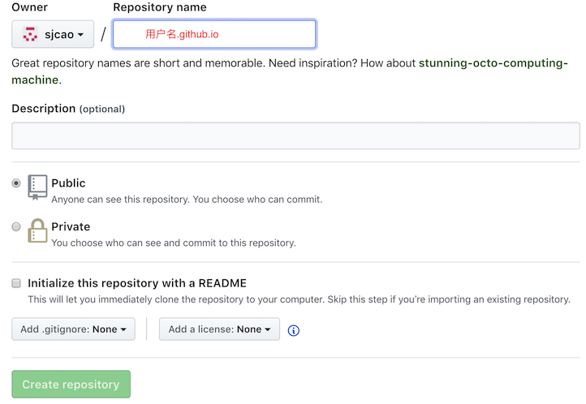
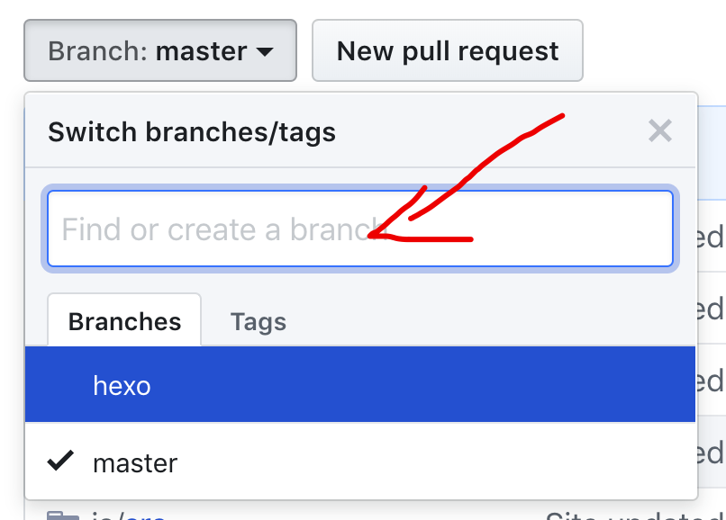

### 安装条件：

1. 已安装git

2. 注册github账号

3. Mac 安装Xcode command line tools    <!-- more -->

   可以在终端输入

   ```
   xcode-select --install
   ```

   mac后期的版本可以独立安装Xcode command line tools而不需要先安装Xcode

4. 安装Node.js（可以官网下载安装包，也可以用nvm安装）  

### 使用nvm安装Node.js

#### 安装nvm

官方安装最新安装指导:    [https://github.com/creationix/nvm#install-script](https://github.com/creationix/nvm#install-script)

你可以使用终端输入以下命令安装:

```
curl -o- https://raw.githubusercontent.com/creationix/nvm/v0.33.11/install.sh | bash
```

验证nvm安装完成,安装完成会显示版本号

```
nvm version
```

由于国内访问nvm安装下载可能会很慢，可以通过设置淘宝的nvm源来加快访问速度。[淘宝nvm源详情](https://npm.taobao.org/)

```
//临时使用
npm --registry https://registry.npm.taobao.org install express
//持久使用
npm config set registry https://registry.npm.taobao.org
```

#### 安装Node.js

使用nvm安装最新的Node.js

```
nvm install node
```

### 安装Hexo

使用nvm安装Hexo

```
npm install -g hexo-cli
```

### Hexo初始化，建立本地博客项目

选定Hexo项目存放位置，如==`~/develop/hexo/`== , 终端cd进当前目录，执行初始化命令：

```
hexo init
```

为了方便发布到github上，安装 ==`hexo-deployer-git`== 插件

```
npm install hexo-deployer-git --save
```

生成静态的网站

```
hexo generate
```

启动本地服务器预览网站，默认访问 [http://localhost:4000/]( http://localhost:4000/ ) 即可看到效果

```
hexo server
```

### 上传博客静态网页到github

#### 创建github仓库

登录github，并创建一个空的仓库，标准命名为`GitHub用户名.github.io`，如：sjcao.github.io。其他选项可以都不用选。



#### 配置SSH密钥

终端输入命令生成ssh公钥和私钥

```
ssh-keygen -t rsa -C 注册github的邮箱地址
```

当提示Enter file in which to save the key，可以指定key保存的文件夹，也直接按回车保存在User目录的.ssh文件夹，不过.ssh文件夹在finder的显示是隐藏的，需要按`shift+command+.`可以显示隐藏文件。

接着需要输入密码，这个密码可以为空的，其实可以不用密码，连续按两次回车键就可以。

也可以用命令打开文件，将公匙内容复制到系统的粘贴板

```
open ~/.ssh/id_rsa.pub
```

登陆GitHub,进入你的Settings。选择SSH and GPG keys。新建SSH key，粘贴密钥，添加即可。

#### 修改博客配置文件

打开hexo根目录下的`_config.yml`,修改配置

```
deploy:
  type: git
  repository: github仓库的ssh路径，比如:git@github.com:sjcao/sjcao.github.io.git
  branch: master
```

发布网站到GitHub

终端执行`hexo generate`后，再执行

```
hexo deploy
```

等待执行完成，可以前往访问你自己的 `github用户名.github.io`访问查看发布后效果。

至此，本地的hexo项目发布到github的步骤已经完成。

### 接下来这个步骤是为了能在不同的机器同步Hexo项目，方便在不同的地方都可以编辑博客。

#### 把Hexo项目同步到Github的仓库的另外一个分支上

先打开github 的仓库网页，选择Branch，并输入分支名新建分支，例如：hexo



#### 通过Git把hexo项目同步到远端hexo分支上

打开hexo所在目录

```
cd ~/develop/hexo
```

初始化git 仓库

```
git init
```

添加所有文件并提交到本地仓库

```
git add -A
git commit -m 'upload hexo'
```

添加远程仓库

```
git remote add origin  你的远程仓库的url
```

修改本地仓库master分支的名称为hexo

```
git branch -m master hexo
```

强制推送本地的仓库到远端的hexo分支

```
git push -f origin hexo
```

至此，本地的Hexo项目已经同步到github的hexo分支上，后期如果更新了博客，顺便也同步到github上的hexo分支上，方便在另外一台机器上克隆下整个Hexo项目